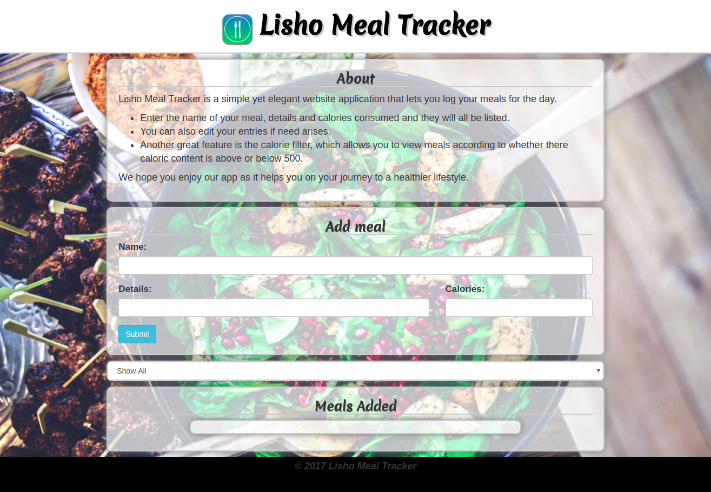
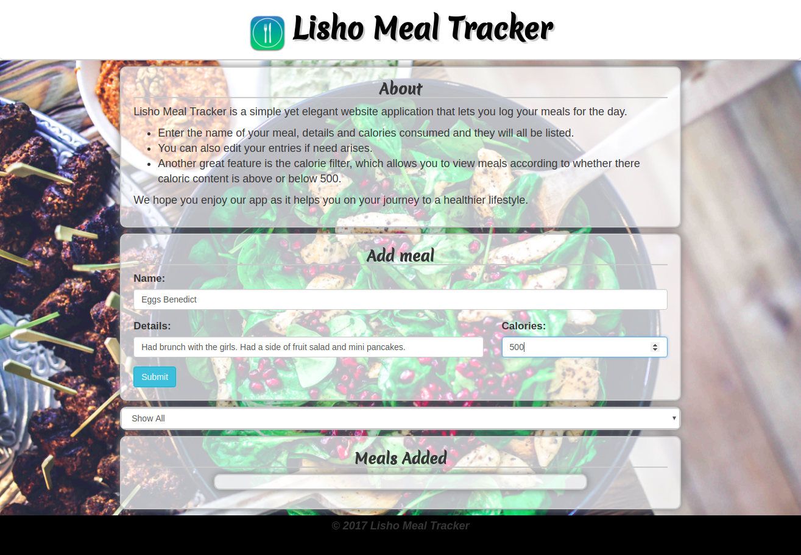
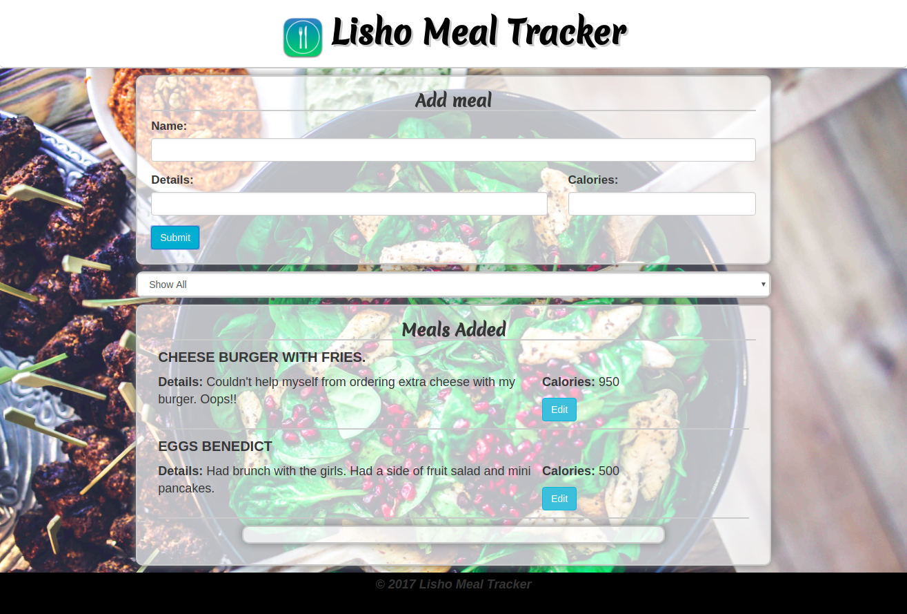
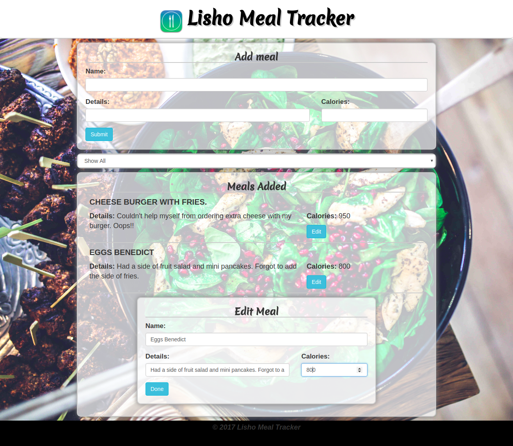

# Lisho Meal Tracker WebApp
#### A meal tracking application where users log foods they’ve eaten each day, including details about the meal and its number of calories, 15/09/2017.

## Built By **[Mary Ng'ang'a](https://github.com/marynganga)**

## Description

This is a meal tracking web application. The user can input information about their meal in a form. The information required is:
* The name of the meal.
* Details about it.
* Caloric content.

Once entered the meals will be displayed in a list. The user has the option of editing any meal already entered. There is also a filter for displaying the meals according to whether there caloric content is above or below 500.

### Features
* About the app section with information about the app.
* A meal entry form.
* An editing meal form.
* Meal list display filter.

## Demo
#### On page load:

#### Adding a new meal:

#### The updated meal list:

#### Editing a meal entry:

## Setup/Installation Requirements
### Prerequisites
You need to have node and npm and bower installed on your machine.
To install:

	* node, visit https://nodejs.org/en/ for guidance. (node comes with npm)
	* bower, on your terminal run $ npm install -g bower  

To clone the repo,

	* $ git  clone https://github.com/marynganga/Meal-Tracker-WebApp.git

For the app to work, you must download dependencies, on your terminal run:	

	* $ npm install
	* $ bower install

## Known Bugs

No known bugs.

## Technologies Used

- HTML
- SCSS
- Angular 2
- TypeScript
- Node packages
- Bower packages

### License

MIT (c) 2017 **[Mary Ng'ang'a](https://github.com/marynganga)**
